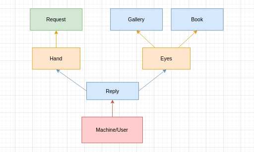
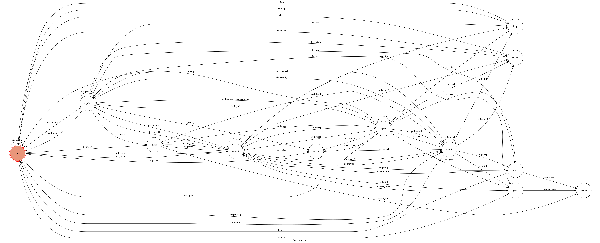
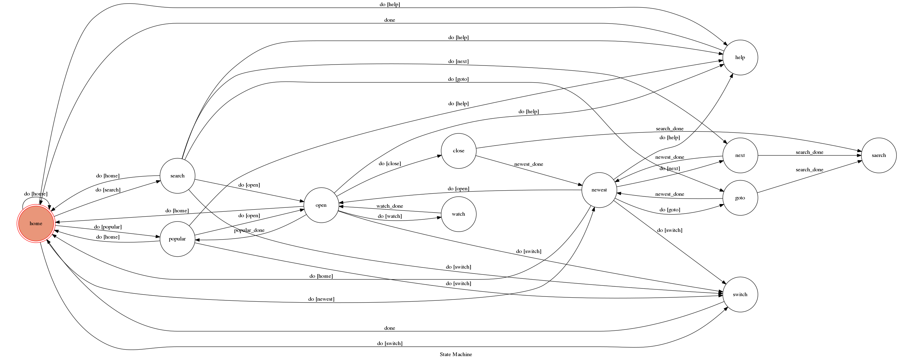

# TOC Project 2020

## Bot 介紹

隨著手機、網路的快速發展，在閒暇時間使用手機觀賞漫畫是一個很好的

但大多數的漫畫網站通常都有廣告的存在，這導致使用者體驗不好，也造成額外的流量使用

因此，我打算使用 Line Bot 搭配 python 爬蟲的方式去爬某個漫畫網站

並透過 Line 傳送純文字訊息來模擬該漫畫網站的操作

這個 Line Bot 可以使用指令來查看當前熱門的漫畫、最新更新的漫畫，或是根據關鍵字來查詢漫畫

當找到想看的漫畫之後，可以指定頁數讓 Bot 透過 Line 傳圖片給使用者觀看

## 系統架構

這個 Bot 主要分成 User(Machine), Hand, Eyes, Request 這幾個 class 進行操作

而 Book, Gallery, Command, Reply 四個 class 來則主要是用來傳遞、儲存資訊

這個架構的想法是模擬一個人在使用一個網站

不論是要看熱門、最新還是利用關鍵字進行搜尋，都需要動手進行操作，所以將這類功能放到 Hand 中

而爬蟲的結果或是當前正在觀看的漫畫的資訊就是使用者眼睛所見的內容，因此會將這類資料存到 Eyes 中

而根據這個架構做出的 bot 則可以畫出下面的下面的 finite state machine 的圖

雖然在上面的 FSM 中看起來大部分的 state 之間都有相連，看起來應該能夠在這些 state 之間進行移動

但並不是有相連的 state 就有可能被 accept

舉圖中的 home 以及 close 兩個 state 作為例子，雖然 home 有指向 close 但是這個操作是不合理的，所以一定會被 reject 並且回傳錯誤訊息提示使用者

而這個 fsm 的圖會有這麼多類似的情況的原因是因為需要考慮到使用者輸入不合理的 command 的情況

原本是使用 User 的 Eyes 裡面的 list 來儲存當前 state 狀況，並在使用者的 command 被 reject 的時候回覆對應訊息提示使用者

但由於必須使用 GraphMachine 來控制 state，所以另外將 User 的功能移動到 Machine 上並讓 Machine 繼承 GraphMachine

因此若是將 Machinie 的各個 command 的 source state 都限定為少數 state 的話，會造成當使用者輸入某些不合理的 command 時 bot 卻不會回覆訊息的情況

為了解決這個問題，在定義各個 command 的 transition function 的時是將 source state 設定成大部份的 state

讓所有 command 都可以在任意 state 被輸入，並在輸入不合理 command 時透過 bot 回應錯誤訊息，而不是沒有任何回應

所以實際上的圖應該以下方的圖來呈現會比較合適

## 已知缺點

在部份 class 中是使用 static variable 來儲存資訊

因此如果有多人同時使用這個 bot 的話會可能造成互相影響的狀況

## WARNING 

以下可能包含成年內容，請三思而入

.
.
.
.
.
.
.
.
.
.

## 示範圖片

### 最近更新的漫畫

### 搜尋漫畫

### 開啟漫畫以及指定頁面

### 切換傳圖模式以及錯誤指令提示

